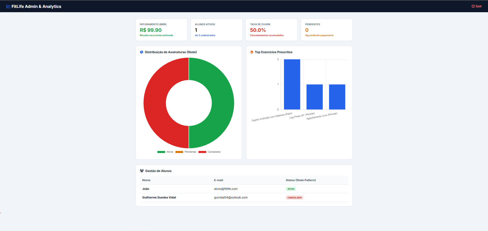
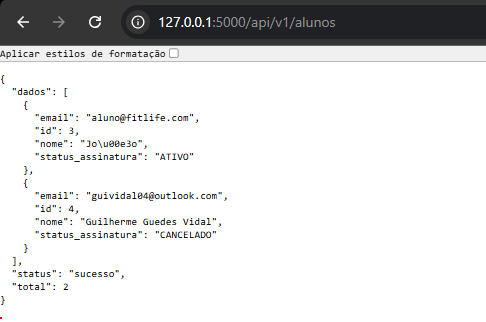

# 🏋️ FitLife — Sistema SaaS de Gestão de Academias

O **FitLife** é um sistema SaaS full-stack desenvolvido em **Python** e **Flask** para gerenciamento completo de academias, alunos, instrutores e prescrição de treinos. 

O projeto foi construído focando em boas práticas de **Engenharia de Software**, **Design Patterns (GoF)**, **Métricas de Produto/Dados (SaaS Analytics)**, **Testes Automatizados** e arquitetura de **API RESTful**.

---

## 🛠️ Tecnologias Utilizadas

* **Backend:** Python 3.10+, Flask, SQLAlchemy, Werkzeug (Segurança & Hashes)
* **Banco de Dados:** SQLite (Relacional)
* **Frontend:** HTML5, CSS3, JavaScript (ES6+), Chart.js (Data Viz), FontAwesome
* **Testes & Qualidade:** PyTest
* **Arquitetura:** MVC, API RESTful (JSON), Design Patterns (State & Builder)

---

## 📐 Padrões de Projeto (Design Patterns)

* **State Pattern (Ciclo de Vida da Assinatura):** Gerencia o status do aluno (`PENDENTE`, `ATIVO`, `CANCELADO`). Controla dinamicamente a liberação ou bloqueio de funcionalidades no sistema e nos endpoints da API (retornando `403 Forbidden` quando inativo).
* **Builder Pattern (Ficha de Treinos):** Permite a construção modular e estruturada do cronograma semanal de treinos dos alunos pelos instrutores.

---

## 📊 Módulos e Funcionalidades

### 1. Dashboard de Analytics (Admin)
* **Product Analytics (SaaS):** Monitoramento de **MRR (Monthly Recurring Revenue)** e **Churn Rate (Taxa de Cancelamento)**.
* **Visualização de Dados:** Gráficos interativos via **Chart.js** exibindo a distribuição de status de assinaturas e os exercícios mais prescritos.

### 2. Autenticação & Segurança
* Controle de acesso baseado em perfis (`ADMIN`, `INSTRUTOR`, `ALUNO`).
* Criptografia e verificação de senhas seguras com `werkzeug.security`.

### 3. API RESTful (`/api/v1`)
* `GET /api/v1/alunos`: Retorna a listagem geral de alunos e seus status em JSON.
* `GET /api/v1/alunos/<id>/treinos`: Consome o cronograma de treino individual integrando a validação de regras do Padrão State.

---

## 🧪 Testes Automatizados

Bateria de testes unitários desenvolvida com **PyTest** para validação das regras de negócio do Padrão State e integridade do Builder:

```bash
# Executar a suíte de testes
py -m pytest 
```

---

## 📸 Demonstração do Sistema

### 📊 Dashboard Administrativo & Analytics SaaS


### 🔌 API RESTful (Endpoint JSON)


---

Markdown
## 🚀 Como Executar o Projeto

1. **Clone o repositório:**
   ```bash
   git clone [https://github.com/guilhermevidalg/fitlife-saas-analytics.git](https://github.com/guilhermevidalg/fitlife-saas-analytics.git)
   cd fitlife-saas-analytics
Instale as dependências:

Bash
py -m pip install flask flask_sqlalchemy pytest
Execute a aplicação:

Bash
py app.py
Acesse no navegador:

http://127.0.0.1:5000


---

### **Passos finais para atualizar no GitHub:**

1. Salve o arquivo no VS Code (`Ctrl + S`).
2. Digite os 3 comandos no terminal:

```powershell
git add README.md
git commit -m "docs: ajusta formatacao final dos passos de execucao"
git push